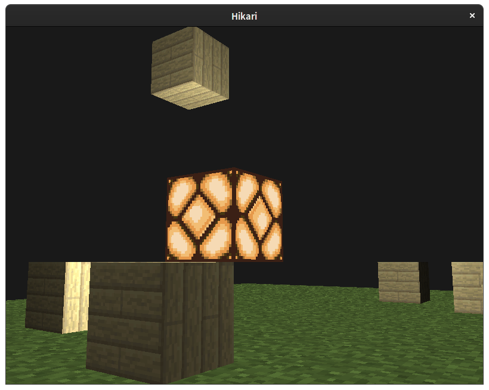

# OpenGL Demo



> 计算机图形血实验

(Core-profile) OpenGL 摄像机+光照演示模型。

因为赶时间，座标系建得略乱，可以自己修改一下。

## Usage

首先安装GLAD和GLFW以及CMake，下载`stb_image.h`到`src`文件夹中(参考(Learn OpenGL)[https://learnopengl.com/]上面的教程)。

For Linux/Unix用户：

```
$ mkdir build && cd build
$ cmake .. && make
$ ./main -h
```

For Windows用户：

请自己翻教程给你的M$VC安装环境。

## License

材质使用的是[Faithful x32](https://www.curseforge.com/minecraft/texture-packs/faithful-team)的MineCraft材质， 请勿用于商业用途

部分资料参考自：[Learn OpenGL](https://learnopengl.com/)

> License: Apache-2.0
